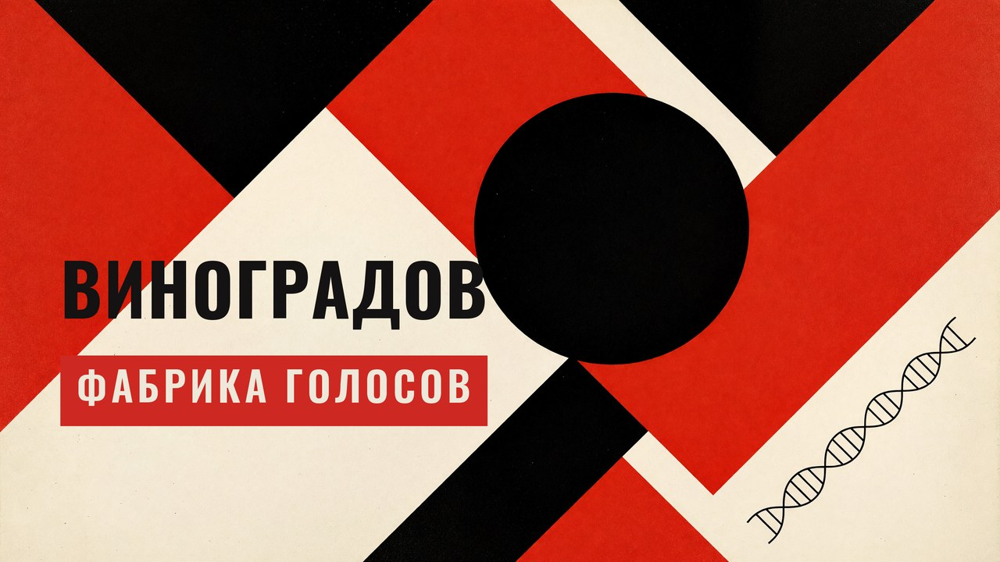
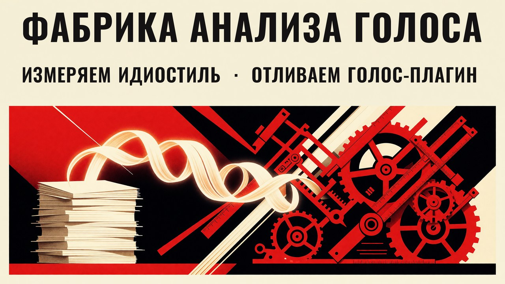
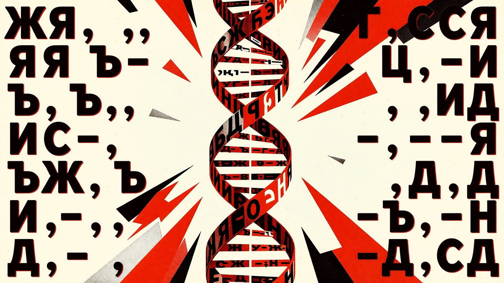

<p align="center">
  
</p>

# Виноградов

> **Claude Code-скил (команда `/vinogradov`) — фабрика авторских голосов: измеряет идиостиль из реального корпуса и собирает из него персональный voice-скил. Сам текстов не пишет — извлекает и упаковывает голос для генерации. Голос не угадывается моделью, а считается стилометрией по 4 слоям: лексика, синтаксис, композиция, образ автора.**

[](LICENSE)
[](https://docs.claude.com/en/docs/claude-code/overview)

Имя — В.В. Виноградов, основатель учения об **авторском стиле** и «образе автора»
(сам термин «идиостиль» оформился в науке уже после него).
Даёте 5–20 своих текстов — скил их измеряет (служебные слова как подпись, ритм,
обороты, богатство словаря, паттерны зачинов и концовок) и собирает готовый
`/voice-{ваш-slug}`, который пишет вашим голосом.

```
/vinogradov
→ интервью (кто, темы, каналы, тон) + ваши образцы
→ детерминированный отчёт: реальные числа по 4 слоям авторского стиля
→ ~/.claude/skills/voice-ivanov/SKILL.md  (+ voice-profile.json)
→ зовёте /voice-ivanov — пишет вашим голосом
```

---

## Зачем

«Напиши как я» — модель по умолчанию пишет усреднённо-гладко и теряет голос.
Описать голос правилами не выходит: «будь ироничным, но не циничным» — от таких
инструкций агент дуреет. Работают **примеры** (дают паттерн и ритм) и **реальные
числа** (а не догадки про «вы пишете коротко»).

Виноградов измеряет то, что человек не посчитает на глаз, и кладёт это в скил
вместе с дословными эталонами автора.

<p align="center">
  <br>
  <sub><i>Фабрика измеряет идиостиль из вашего корпуса — и отливает из него голос-плагин</i></sub>
</p>

## Как работает

В основе — **4 слоя авторского стиля по Виноградову**, каждый считается детерминированно:

1. **Лексический** — служебные слова как подпись (через **отклонение** от нормы
   языка, а не сырую частоту: «и/в/не» частотны у всех — различает над/недо-
   употребление); дискурсивные вводные; характерные обороты; богатство словаря
   (TTR, Yule's K, hapax).
2. **Синтаксический** — длина предложений и **burstiness** (CV = σ/μ): «игра длиной»
   ловится дисперсией, которую среднее прячет; пунктуационная сигнатура.
3. **Композиционный** — ритм абзацев, зачины-сигналы (вход в мысль с контраста),
   тип концовок (точка / вопрос-ловушка / обрыв).
4. **Образ автора** — маркеры тона/иронии, регистр (разговорный ↔ формальный).

Два анти-шумовых фильтра: обороты отсекаются по **document-frequency** (повтор
внутри одного поста ≠ голос), а **стилистические** обороты автоматически отделяются
от **тематических** (фраза с редким именем/термином — это тема, не голос).

<p align="center">
  <br>
  <sub><i>ДНК идиостиля: 4 слоя авторского стиля — лексика, синтаксис, композиция, образ автора</i></sub>
</p>

## Что внутри

```
scripts/analyze_corpus.py     детерминированный анализатор (4 слоя), без зависимостей
scripts/extract_telegram.py   корпус из JSON-экспорта Telegram Desktop
references/extraction-guide.md       интервью + маппинг отчёт→шаблон + схема профиля
references/voice-skill-template.md   шаблон выходного voice-скила
references/universal-anti-slop.md    общий анти-AI-слой для собранных скилов
SKILL.md                      сам мастер
```

> Требуется Python 3 (только стандартная библиотека).

## Установка

```bash
git clone https://github.com/beaverbeard/vinogradov.git ~/.claude/skills/vinogradov
```

Перезапустите Claude Code — скил `vinogradov` и команда `/vinogradov` появятся.

## Использование

```bash
/vinogradov                       # запустить мастер (интервью → образцы → сборка)
# или словами: «склонируй мой голос», «собери voice dna канала», «обнови мой голос»

# проверить вручную, из чего собран голос (без интервью):
python3 ~/.claude/skills/vinogradov/scripts/analyze_corpus.py /tmp/corpus.txt
```

## Принципы

- **Примеры > правила** — 3–4 дословных эталона калибруют сильнее страницы инструкций.
- **Негатив > позитив** — off-brand и табу ловятся быстрее, чем «делай так».
- **Только настоящее** — отпечаток из реальных частот; темы ≠ голос; шум отфильтрован.
- **Три контекста раздельно** — голос ≠ правила работы ≠ описание издания/аудитории.

## На чьих плечах

Виноградов — **форк и развитие** двух публичных линий:

- **[`voice-dna-builder`](https://github.com/ponomr/voice-dna-builder)** (Алексей
  Пономарь, MIT) — **движок**: детерминированный анализатор корпуса, воркфлоу
  интервью→анализ→сборка, `voice-profile.json` для инкрементального обновления и
  концепция общего анти-слоя. Код `analyze_corpus.py` и `extract_telegram.py`
  форкнут отсюда (копирайт сохранён в [LICENSE](LICENSE)).
- **[`brand-voice-writer`](https://github.com/timescale/marketing-skills)** из
  Tiger Data marketing-skills — методика **voice-profile** и архитектура voice-
  плагинов, плюс паттерн тонких SKILL-обёрток.

Что добавил Виноградов поверх: 4-слойный отчёт об авторском стиле, подпись по отклонению
служебных слов (мини-Burrows), burstiness, TTR / Yule's K / hapax, авто-разделение
стилистических оборотов и тематического шума. Стилометрические меры — из литературы
по authorship attribution; учение об «авторском стиле» и «образе автора» — по В.В. Виноградову.

## Родственные скилы

Виноградов собирает **голос**; этим голосом пишет черновик
[Бахтин](https://github.com/beaverbeard/bakhtin) (multi-agent генератор), а
вычитку закрывает семья редакторских скилов
[рИИдактор](https://redaktozavr.ru/rAIdactor?utm_source=skills):

| Скил | Зона |
|------|------|
| [Бахтин](https://github.com/beaverbeard/bakhtin) | Генерация черновика (multi-agent, 7 форматов) |
| [Чуковский](https://github.com/beaverbeard/chukovsky) | Смысл, структура, голос, канцелярит |
| [Аграновский](https://github.com/beaverbeard/agranovsky) | Верификация фактов |
| [Слопотрон](https://github.com/beaverbeard/slopotron) | AI-маркеры и нейрослоп |
| [Розенталь](https://github.com/beaverbeard/rozental) | Орфография, пунктуация, единообразие |
| [Мильчин](https://github.com/beaverbeard/milchin) | Типографика и юникод-гигиена |

## Лицензия

[MIT](LICENSE) © 2026 Alexey Ponomar (original engine) · Rodion Scryabin ([@beaverbeard](https://github.com/beaverbeard)) (fork & enhancements)
